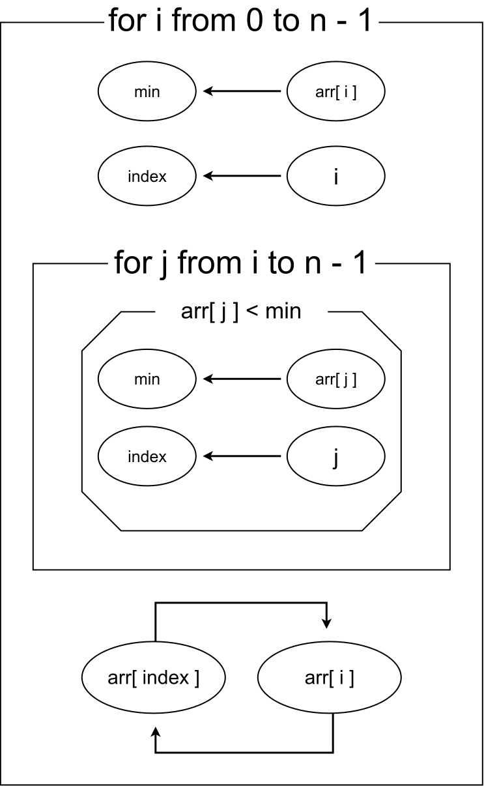

# MatryGram Examples

This directory contains examples of algorithms represented in MatryGram.

These examples show how MatryGram represents nested algorithmic structures in practice.

## Example 1 — Selection Sort



### C Code

```c
#include <stdio.h>

int main(void) {
	int arr[10];
	int i, j, index, tmp, min;

	printf("Enter integers>> ");

	for (i = 0; i < 10; i++) {
		scanf("%d", &arr[i]);
	}

	for (i = 0; i < 10; i++) {
		min = arr[i];
		index = i;

		for (j = i; j < 10; j++) {
			if (arr[j] < min) {
				min = arr[j];
				index = j;
			}
		}

		tmp = arr[index];
		arr[index] = arr[i];
		arr[i] = tmp;
	}

	for (i = 0; i < 10; i++) printf("%d ", arr[i]);
}
```
