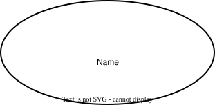
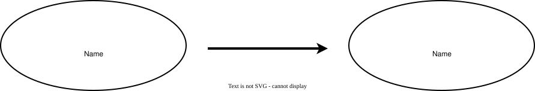
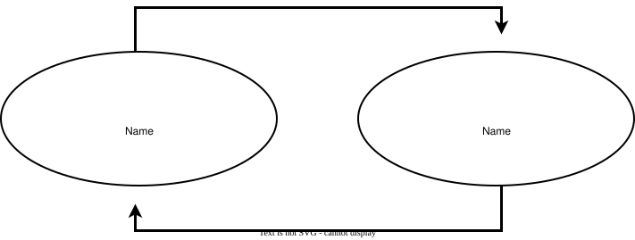

# MatryGram v0.1 Specification

This document defines the syntax and elements of MatryGram v0.1.

This specification may change in future versions.

## Basic Syntax

MatryGram uses spatial relationships to represent hierarchy and execution order.

### Hierarchy

A child element is placed inside the box of its parent element.

### Sequential Execution

Elements at the same level that execute in sequence are arranged vertically, from top to bottom.

### Independent Execution

Elements at the same level with no defined execution order are arranged horizontally. These elements may be executed in any order.

## Elements

### Variable

Represents a variable.
The variable's name is written inside the element.

### Assignment

Represents assigning a value to a variable.
The arrow points from the source value to the destination variable.

### Swap

Represents exchanging the values of two variables.
The two variables are connected by arrows pointing in opposite directions.
The two variables may be placed in any position relative to each other, as long as each has an arrow pointing to the other.

### Statement

Represents an executable statement that does not define a conditional or loop structure.
The operation to be executed is written inside the element.

### Conditional

Represents a conditional structure.
The condition is written at the top of the element.
Elements placed inside it are executed only when the condition is satisfied.

### Loop

Represents a loop structure.
The loop condition or repetition rule is written at the top of the element.
Elements placed inside it are executed repeatedly according to that condition or rule.
